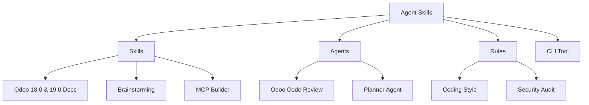

# 🚀 Agent Skills


---

## 🌟 Overview

**Agent Skills** is a high-performance ecosystem featuring **versioned documentation, specialized skill packs, and expert agents**. This repository transforms generic AI assistants into domain-specific powerhouses, providing the deep technical context required for professional software engineering.

By integrating **Agent Skills** into IDEs like **Cursor, Claude Code, Windsurf, or Aider**, you ensure your AI partner inherits thousands of lines of curated, framework-specific knowledge, elite coding patterns, and automated review capabilities.

---

## ✨ Key Features

|        Specialized Skills         |       Expert Agents       |   Intelligence Rules    |
| :-------------------------------: | :-----------------------: | :---------------------: |
| Versioned Docs (Odoo 18.0 & 19.0) | Dedicated code reviewers  |  Standard Coding Style  |
|   Optimized for context windows   | Scoring-based assessments | Security Audit Patterns |
|     8,000+ lines of expertise     | Best-practice enforcement | Implementation Planning |

---

## 📂 Project Structure



---

## 🚀 Quick Start

### 1. Installation via NPX (Recommended)

The fastest and most flexible way to add Agent Skills to your project is via the `skills` command:

```bash
# Add the Agent Skills repository to your current project
npx skills add unclecatvn/agent-skills
```

### 2. Manual CLI Installation

For deep integration and local version management:

```bash
# Install globally
npm install -g @unclecat/agent-skills-cli

# Initialize a specific skill (e.g., Odoo 19 for Cursor)
agent-skills init --ai cursor odoo --version 19.0
```

---

## 📦 Core Components

### 🏗️ Skill Packs (`/skills`)

Deep technical documentation optimized for token-efficient AI consumption.

- **[Odoo 18.0](skills/odoo/18.0/) & [19.0](skills/odoo/19.0/)**: 21+ specialized guides covering ORM, OWL, Web Client, and Performance.
- **[Brainstorming](skills/brainstorming/SKILL.md)**: Structured frameworks for feature Ideation.
- **[MCP Builder](skills/mcp-builder/SKILL.md)**: Instructions for building Model Context Protocol servers.

### 🛡️ Expert Agents (`/agents`)

Autonomous agents that act as senior technical leads.

- **[Odoo Reviewer](agents/odoo-code-review/SKILL.md)**: Automated code review with weighted scoring (1-10).
- **[Planner](agents/planner.md)**: Expert at breaking down complex features into actionable steps.

### 📏 Intelligence Rules (`/rules`)

Strict enforcement of coding standards and security protocols.

- **[Coding Style](rules/coding-style.md)**: Best practices for naming, imports, and structure.
- **[Security](rules/security.md)**: Hardened rules for enterprise application development.

---

## 📊 Project Statistics

| Category                | Coverage                             |
| ----------------------- | ------------------------------------ |
| **Total Documentation** | 10,000+ Lines                        |
| **Active Skill Packs**  | Odoo 18.0, 19.0, Brainstorming, MCP  |
| **Specialized Agents**  | Reviewers & Planners                 |
| **Supported IDEs**      | Cursor, Claude Code, Windsurf, Aider |
| **License**             | MIT                                  |

---

## 🤝 Contributing

We welcome contributions to expand the intelligence available to the community. Please see our [Contributing Guide](#contributing) for details on how to add new skills, agents, or commands.

---

_Last updated: January 31, 2026_
