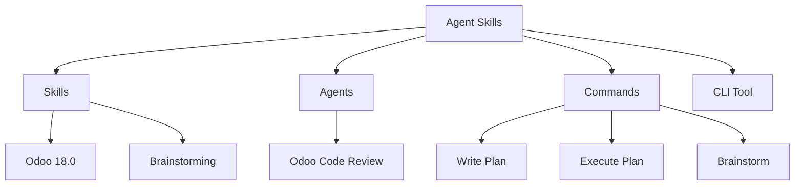

# 🚀 Agent Skills

> **Turbocharge your AI Development Assistants with Domain-Specific Intelligence.**


_(Note: Project banner featuring agent-skills architecture.)_

---

## 🌟 Overview

**Agent Skills** is a comprehensive ecosystem of **versioned documentation, skill packs, specialized agents, and command templates**. It is designed to bridge the gap between generic AI models and the deep, domain-specific knowledge required for professional enterprise development.

Whether you're using **Cursor, Claude Code, Windsurf, or Aider**, Agent Skills injects precise context into your workflow, ensuring your AI assistant speaks the language of your framework perfectly.

---

## ✨ Key Features

|        🧠 Specialized Skills         |     🤖 Expert Agents      |     ⚡ Quick Commands     |
| :----------------------------------: | :-----------------------: | :-----------------------: |
| Versioned framework docs (Odoo 18.0) | Dedicated code reviewers  | Reusable prompt templates |
|    Optimized for context windows     | Scoring-based assessments | Structured brainstorming  |
|      8,000+ lines of expertise       | Best-practice enforcement |  Implementation planning  |

---

## 📂 Project Structure



---

## 🚀 Quick Start

### 1. Remote Configuration (Cursor)

The most seamless way to use Agent Skills in Cursor:

1. Go to **Settings** → **Rules** → **Add Remote Rule**
2. URL: `git@github.com:unclecatvn/agent-skills.git`
3. Branch: `odoo/18.0`

### 2. NPM CLI Installation

Install and manage skills directly in your local project:

```bash
npm install -g @unclecat/agent-skills-cli
agent-skills init --ai cursor odoo --version 18.0
```

---

## 📦 Core Components

### 🏗️ Skill Packs

Deep technical documentation optimized for AI consumption.

- **[Odoo 18.0](skills/odoo/18.0/)**: 9 specialized guides covering ORM, OWL, Performance, and more.
- **[Brainstorming](skills/brainstorming/SKILL.md)**: Facilitates structured feature planning.

### 🛡️ Specialized Agents

Agents that act as senior technical leads.

- **[Odoo Reviewer](agents/odoo-code-review/SKILL.md)**: Automated code review with weighted scoring.

### 📜 Command Templates

Slash commands for common developer tasks.

- `/write-plan`: Create detailed implementation plans.
- `/code-reviewer`: Trigger a deep review of your current file.

---

## 📊 Project Statistics

| Category                | Coverage                             |
| ----------------------- | ------------------------------------ |
| **Total Documentation** | 8,000+ Lines                         |
| **Active Skill Packs**  | Odoo 18.0                            |
| **Supported IDEs**      | Cursor, Claude Code, Windsurf, Aider |
| **License**             | MIT                                  |

---

## 🗺️ Roadmap

- [ ] **Odoo 19.0** Support (Coming Q3 2026)
- [ ] **Laravel** & **Django** Skill Packs
- [ ] **Automated Migration Agents**
- [ ] **Testing Specialists** (Pytest/Unittest)

---

## 🤝 Contributing

We welcome contributions to expand the intelligence available to the community. Please see our [Contributing Guide](#contributing) for details on how to add new skills, agents, or commands.

---

_Last updated: January 2026_
