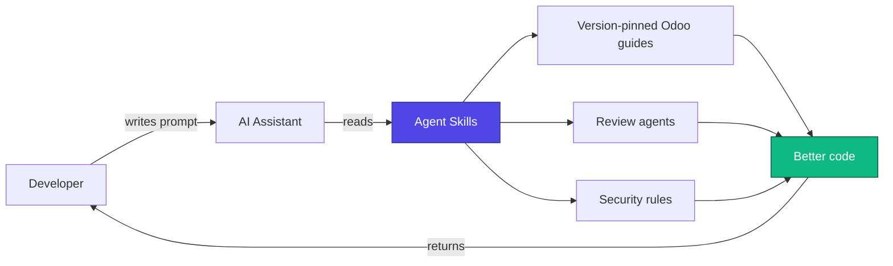

<div align="center">

# Agent Skills


**Curated AI skill packs for Odoo development, code review, and professional workflows — 57k+ lines of version-pinned framework expertise.**

[](https://www.npmjs.com/package/@unclecat/agent-skills-cli)
[](https://www.npmjs.com/package/@unclecat/agent-skills-cli)
[](LICENSE)
[](https://github.com/unclecatvn/agent-skills/stargazers)
[](https://github.com/unclecatvn/agent-skills/commits/main)
[](https://github.com/unclecatvn/agent-skills/pulls)
[](https://nodejs.org)

</div>

---

## Table of Contents

- [What is Agent Skills?](#what-is-agent-skills)
- [Why use it?](#why-use-it)
- [Quick Start](#quick-start)
- [Real-World Example](#real-world-example)
- [What's Inside?](#whats-inside)
  - [Skills — Framework Documentation](#skills--framework-documentation)
  - [Agents — Autonomous Reviewers](#agents--autonomous-reviewers)
  - [Rules — Coding Standards](#rules--coding-standards)
- [Targeting an Odoo Version](#targeting-an-odoo-version)
- [Project Structure](#project-structure)
- [Supported IDEs](#supported-ides)
- [How It Works](#how-it-works)
- [Stats](#stats)
- [Contributing](#contributing)
- [Links](#links)

---

## What is Agent Skills?

**Agent Skills** is a collection of documentation and specialized agents that supercharge AI coding assistants like Cursor, Claude Code, Windsurf, and Aider.

Think of it as a **knowledge pack** — when you add Agent Skills to your project, your AI assistant gains access to thousands of lines of curated technical expertise about Odoo and related workflows. That means better code suggestions, fewer version-mismatch bugs, and more helpful responses.

Each Odoo skill pack is pinned to a specific major version (**16.0 · 17.0 · 18.0 · 19.0**) with an `api-highlights.md` file that captures the rules that differ between versions.

---

## Why use it?

| Without Agent Skills | With Agent Skills |
|---|---|
| Generic "how to write a Python function" | Framework-specific "how to write an Odoo model with proper ORM patterns" |
| AI guesses at framework conventions | AI follows documented best practices |
| You re-explain project context every session | Context lives in the repo — AI reads it automatically |
| Subtle bugs from outdated or mixed-version advice | Version-pinned guides (Odoo 16 / 17 / 18 / 19) |
| Generic security suggestions | Enforced security rules for enterprise applications |

---

## Quick Start

### Option 1 — Cursor Skills (recommended)

Install the full repository into your project:

```bash
npx skills add unclecatvn/agent-skills
```

Your AI assistant will discover skills, agents, and rules from the repo automatically.

### Option 2 — CLI (pick a skill pack and version)

Install a specific pack into your project with the bundled CLI:

```bash
# List available Odoo versions
npx @unclecat/agent-skills-cli versions skills

# Install Odoo 18 guides for Cursor
npx @unclecat/agent-skills-cli init --ai cursor --skill skills --version odoo-18.0

# Install for all supported assistants
npx @unclecat/agent-skills-cli init --ai all --skill skills --version odoo-19.0
```

Supported `--ai` targets: `cursor`, `claude`, `antigravity`, `kiro`, `docs`, `all`.

Other installable packs: `code-review`, `dtg-base`, `flow-diagram`, `odoo-commit`, `slide`.

### Option 3 — Claude Code plugin

Install via the Claude plugin marketplace defined in [`.claude-plugin/marketplace.json`](.claude-plugin/marketplace.json). The plugin bundles Odoo skill packs (16–19), code review, DTG Base, Odoo Commit, Flow Diagram, slide decks, and the Odoo review/tracer agents.

---

## Real-World Example

**Prompt:**
> *"Add a computed field `total_with_tax` to `sale.order` that sums line totals plus VAT."*

<table>
<tr>
<th>Without Agent Skills</th>
<th>With Agent Skills</th>
</tr>
<tr>
<td valign="top">

```python
# Generic guess — may use
# wrong API for your Odoo version
total_with_tax = fields.Float(
    compute='_compute_total'
)

def _compute_total(self):
    for rec in self:
        rec.total_with_tax = sum(
            l.price * 1.1
            for l in rec.order_line
        )
```

</td>
<td valign="top">

```python
# Odoo conventions (16 / 17 / 18 / 19):
# Monetary + @api.depends + store
total_with_tax = fields.Monetary(
    compute='_compute_total_with_tax',
    store=True,
    currency_field='currency_id',
)

@api.depends('order_line.price_total')
def _compute_total_with_tax(self):
    for order in self:
        order.total_with_tax = sum(
            order.order_line.mapped('price_total')
        )
```

</td>
</tr>
</table>

---

## What's Inside?

### Skills — Framework Documentation

In-depth guides written for AI consumption. Each Odoo pack includes 18 topic guides plus `api-highlights.md`, `SKILL.md`, `CLAUDE.md`, and `AGENTS.md`.

| Skill | Description |
|-------|-------------|
| **[Odoo 16.0](skills/odoo-16.0/)** | Odoo 16 development — `<tree>` views, `attrs`/`states` modifiers, `group_operator=`, explicit chatter block, `kanban-box` templates |
| **[Odoo 17.0](skills/odoo-17.0/)** | Odoo 17 development — `<tree>` views, direct-expression modifiers (no `attrs`), `group_operator=`, JSONB translations, OWL 2.8 |
| **[Odoo 18.0](skills/odoo-18.0/)** | Odoo 18 development — `<list>` views, `aggregator=`, `<chatter/>` shortcut, ORM, security, OWL, reports, migrations, performance |
| **[Odoo 19.0](skills/odoo-19.0/)** | Odoo 19 development — optional `_name`, `models.Constraint` / `models.Index`, current view and frontend conventions |
| **[Odoo Commit](skills/odoo-commit/)** | Guides Odoo-style commit creation — message drafting, amend-vs-new-commit decisions, explicit staging, `git commit -F`, and local history cleanup before PRs |
| **[Flow Diagram](skills/flow-diagram/)** | Interactive self-contained HTML+SVG flow/architecture diagrams — zoom/pan, click-to-highlight flows, traveling dots, collision checkers |
| **[DTG Base](skills/dtg-base/)** | DTGBase utilities — date/period, timezone, batch processing, barcode, Vietnamese text, file helpers |
| **[Code Review](skills/code-review/)** | Receiving feedback, requesting reviews, and verification gates for evidence-based development |
| **[Slide (AI Vibe Slides)](skills/slide/)** | Self-contained HTML/React slide decks for fullscreen presentation |

#### Odoo reference guide topics (each version)

actions · controllers · data files · decorators · development workflow · fields · manifest · migrations · mixins · models · OWL · performance · reports · security · testing · transactions · translations · views

### Agents — Autonomous Reviewers

Specialized agents that act as senior technical leads:

| Agent | What it does |
|-------|--------------|
| **[Odoo Code Review](agents/odoo-code-review/SKILL.md)** | Reviews Odoo code with scoring and structured feedback. Version-aware (16 / 17 / 18 / 19). |
| **[Odoo Code Tracer](agents/odoo-code-tracer/SKILL.md)** | Traces execution flow from an entry point through the call graph. Version-aware (16 / 17 / 18 / 19). |
| **[Planner](agents/planner.md)** | Breaks down complex features into actionable implementation steps |

### Rules — Coding Standards

Enforced patterns for consistent, secure code:

| Rule | Description |
|------|-------------|
| **[Coding Style](rules/coding-style.md)** | Naming, imports, and code structure |
| **[Security](rules/security.md)** | Security patterns for enterprise applications |

---

## Targeting an Odoo Version

The Odoo agents automatically pick the right reference pack (`skills/odoo-16.0/` … `odoo-19.0/`). Resolution order:

1. **Explicit argument** passed to the agent (e.g. `odoo_version: "19.0"`).
2. **Project config**, in order:
   - `.odoo-version` at the repo root
   - `odoo_version` in `.claude/odoo.json`
   - `odoo.version` in `package.json`
   - `tool.odoo.version` in `pyproject.toml`
3. **Manifest heuristic** — dominant major version from workspace `__manifest__.py` files.
4. **Fallback** — latest supported (`19.0`). The agent states the assumption in its output.

Per-version rule deltas live in each pack's `references/api-highlights.md`. Examples:

| Topic | 16.0 | 17.0 | 18.0+ |
|-------|------|------|-------|
| List view tag | `<tree>` | `<tree>` | `<list>` |
| Dynamic modifiers | `attrs` / `states` | direct expressions | direct expressions |
| Field aggregation | `group_operator=` | `group_operator=` | `aggregator=` |
| Chatter | explicit block | explicit block | `<chatter/>` |

---

## Project Structure

```
agent-skills/
├── skills/
│   ├── odoo-16.0/             # Odoo 16 guides + api-highlights
│   ├── odoo-17.0/             # Odoo 17 guides + api-highlights
│   ├── odoo-18.0/             # Odoo 18 guides + api-highlights
│   ├── odoo-19.0/             # Odoo 19 guides + api-highlights
│   ├── odoo-commit/           # Odoo-style commit workflow and message guidance
│   ├── flow-diagram/          # Interactive HTML+SVG flow/architecture diagrams
│   ├── dtg-base/              # DTGBase utilities
│   ├── code-review/           # Code review workflow
│   └── slide/                 # HTML/React slide decks
├── agents/
│   ├── odoo-code-review/      # Version-aware Odoo reviewer
│   ├── odoo-code-tracer/      # Version-aware call-graph tracer
│   └── planner.md             # Feature planning agent
├── rules/                     # Coding style and security
├── bin/                       # CLI (`agent-skills`)
├── tests/                     # Structural validator (`npm test`)
├── .claude-plugin/            # Claude Code plugin + marketplace
├── .github/workflows/         # CI, SkillSpector scan, release guards
├── CHANGELOG.md
└── lib/                       # Shared assets (images)
```

---

## Supported IDEs

Agent Skills works with popular AI-powered IDEs:

| IDE / Tool | Install method |
|------------|----------------|
| **Cursor** | `npx skills add unclecatvn/agent-skills` or CLI `--ai cursor` |
| **Claude Code** | Plugin marketplace or CLI `--ai claude` |
| **Antigravity** | CLI `--ai antigravity` |
| **Kiro** | CLI `--ai kiro` |
| **Plain docs folder** | CLI `--ai docs` |

---

## How It Works


```mermaid
flowchart LR
    A[Developer] -->|writes prompt| B[AI Assistant]
    B -->|reads| C[Agent Skills]
    C --> D[Version-pinned Odoo guides]
    C --> E[Review agents]
    C --> F[Security rules]
    D --> G[Better code]
    E --> G
    F --> G
    G -->|returns| A

    style C fill:#4f46e5,stroke:#312e81,color:#fff
    style G fill:#10b981,stroke:#064e3b,color:#fff
```

1. Add Agent Skills to your project (Cursor, CLI, or Claude plugin).
2. Your AI assistant reads the relevant skill files for the task.
3. Odoo agents resolve the target version and load the matching reference pack.
4. You get framework-specific guidance instead of generic guesses.

---

## Stats

| Metric | Value |
|--------|-------|
| Documentation | ~57,000 lines |
| Odoo skill packs | 4 (16.0, 17.0, 18.0, 19.0) |
| Other skill packs | 5 (DTG Base, Code Review, Odoo Commit, Flow Diagram, Slide) |
| Agents | 3 (Odoo Code Review, Odoo Code Tracer, Planner) |
| Rules | 2 (Coding Style, Security) |
| Current release | [1.0.14](CHANGELOG.md) |
| License | MIT |

---

## Contributing

Contributions are welcome:

- **Improve Odoo guides** — fix errors, add examples, keep version deltas accurate
- **Add new skill packs** — follow the structure in `skills/odoo-18.0/`
- **Extend agents** — build specialized reviewers or planners under `agents/`
- **Report issues** — open an issue if something is missing or broken

Before opening a PR:

```bash
npm test          # structural validation (SKILL.md frontmatter, plugin paths, changelog)
```

CI also runs [SkillSpector](https://github.com/NVIDIA/skillspector) on `./skills/` with a baseline in `.skillspector-baseline.yaml`. Version bumps require a matching section in `CHANGELOG.md`.

[](https://github.com/unclecatvn/agent-skills/graphs/contributors)
[](https://github.com/unclecatvn/agent-skills/issues)
[](https://github.com/unclecatvn/agent-skills/pulls)

---

## Links

- [Changelog](CHANGELOG.md)
- [Issues](https://github.com/unclecatvn/agent-skills/issues)
- [Discussions](https://github.com/unclecatvn/agent-skills/discussions)
- [Releases](https://github.com/unclecatvn/agent-skills/releases)
- [npm Package](https://www.npmjs.com/package/@unclecat/agent-skills-cli)

---

<div align="center">

_If you find this project helpful, please consider giving it a star._

[](https://star-history.com/#unclecatvn/agent-skills&Date)

</div>
