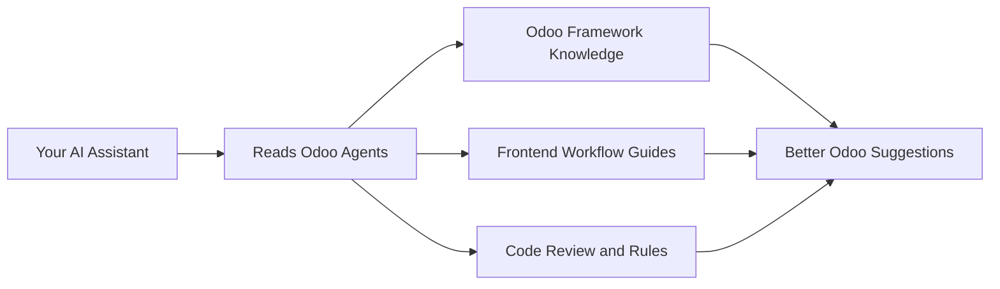

# Odoo Agents


---

## What is Odoo Agents?

**Odoo Agents** is a collection of documentation and specialized agents that help AI coding assistants work more effectively on Odoo and related engineering tasks.

Think of it as a knowledge pack: when you add this repository to your project, your AI assistant gains access to curated implementation guidance, review rules, and task-specific frontend workflows that are tailored to real Odoo development.

### Why use it?

- Generic AI assistants give broad programming advice
- AI assistants with Odoo Agents give Odoo-specific guidance, patterns, and guardrails

For example, instead of a generic answer about frontend components, you can route the assistant into dedicated skills for Owl component authoring, webclient extension points, or HOOT-based frontend tests.

---

## Quick Start

Get started with skills.sh:

```bash
npx skills add milzamsz/odoo-agents
```

### Alternative: Manual Installation

```bash
npm install -g @unclecat/agent-skills-cli
agent-skills init --ai cursor odoo --version 19.0
```

---

## What's Inside?

### Skills - Framework Documentation

In-depth guides written specifically for AI consumption:

| Skill | Description |
|-------|-------------|
| **[Odoo 18.0](skills/odoo-18.0/)** | Master Odoo 18 guide covering ORM, XML, reports, testing, and bridge docs for frontend work |
| **[Odoo 19.0](skills/odoo-19.0/)** | Master Odoo 19 guide covering current Odoo APIs and bridge docs for frontend work |
| **[Odoo OWL](skills/odoo-owl/)** | Dedicated Odoo 18/19 Owl component skill for JS/XML/SCSS triplets, assets, templates, and runtime decisions |
| **[Odoo Webclient Extension](skills/odoo-webclient-extension/)** | Registries, client actions, services, hooks, and safe patching patterns for Odoo 18/19 |
| **[Odoo Owl Testing](skills/odoo-owl-testing/)** | HOOT, `web_test_helpers`, `mock_server`, and `web.assets_unit_tests` guidance for Odoo 18/19 |
| **[DTG Base](skills/dtg-base/)** | DTGBase utilities (date/period, timezone, batch, barcode, Vietnamese text) |
| **[Payment Integration](skills/payment-integration/)** | Integration guides for SePay, Polar, Stripe, Paddle, Creem.io |
| **[Code Review](skills/code-review/)** | Standards and protocols for automated code review |
| **[Brainstorming](skills/brainstorming/)** | Structured framework for feature ideation |
| **[Writing Skills](skills/writing-skills/)** | Guide for creating and editing AI skills |
| **[MCP Builder](skills/mcp-builder/)** | Guide for building Model Context Protocol servers |

### Agents - Autonomous Reviewers

Specialized agents that act as senior technical leads:

| Agent | What it does |
|-------|--------------|
| **[Odoo Code Review](agents/odoo-code-review/SKILL.md)** | Automatically reviews Odoo code with scoring (1-10) and detailed feedback |
| **[Odoo Code Tracer](agents/odoo-code-tracer/SKILL.md)** | Traces execution flow from entry point to end, identifying all function calls |
| **[Odoo Module Generator](agents/odoo-module-generator/SKILL.md)** | Scaffolds complete Odoo 18 modules with proper structure |
| **[Odoo Query Optimizer](agents/odoo-query-optimizer/SKILL.md)** | Diagnoses N+1 queries and provides optimization suggestions |
| **[Odoo Migration Helper](agents/odoo-migration-helper/SKILL.md)** | Converts Odoo 16/17 code to Odoo 18 patterns |
| **[Planner](agents/planner.md)** | Breaks down complex features into actionable implementation steps |

### Rules - Coding Standards

Enforced patterns for consistent, secure code:

| Rule | Description |
|------|-------------|
| **[Coding Style](rules/coding-style.md)** | Best practices for naming, imports, and code structure |
| **[Security](rules/security.md)** | Security patterns for enterprise applications |

---

## Project Structure

```text
odoo-agents/
|-- skills/
|   |-- odoo-18.0/                 # Odoo 18 master guide
|   |-- odoo-19.0/                 # Odoo 19 master guide
|   |-- odoo-owl/                  # Dedicated Owl component skill
|   |-- odoo-webclient-extension/  # Dedicated webclient extension skill
|   |-- odoo-owl-testing/          # Dedicated Owl testing skill
|   |-- dtg-base/
|   |-- payment-integration/
|   |-- code-review/
|   |-- brainstorming/
|   |-- writing-skills/
|   `-- mcp-builder/
|-- agents/
|-- rules/
|-- tests/
`-- lib/
```

---

## Validation

Run the repository smoke test:

```bash
npm test
```

This validates the merged Owl skill layout and confirms the Odoo 18/19 bridge docs link to the dedicated frontend skills.

---

## Supported IDEs

Odoo Agents works with popular AI-powered IDEs:

- **Cursor** - Remote rule or local skill installs
- **Claude Code** - Native skill support
- **Windsurf** - Compatible
- **Aider** - Compatible

---

## How It Works


```mermaid
graph LR
    A["Your AI Assistant"] --> B["Reads Odoo Agents"]
    B --> C["Odoo Framework Knowledge"]
    B --> D["Frontend Workflow Guides"]
    B --> E["Code Review and Rules"]
    C --> F["Better Odoo Suggestions"]
    D --> F
    E --> F
```

1. You add Odoo Agents to your project.
2. Your AI assistant reads the relevant skill files.
3. The assistant routes frontend-heavy Odoo requests into the dedicated Owl skills when needed.
4. You get more accurate, version-aware implementation guidance.

---

## Stats

| Metric | Value |
|--------|-------|
| Skill Packs | 11 |
| Dedicated Odoo Frontend Skills | 3 |
| Agents | 6 |
| License | MIT |

---

## Contributing

We welcome contributions:

- Add new skills
- Improve existing docs
- Create agents
- Report issues

---

## Links

- [Repository](https://github.com/milzamsz/odoo-agents)
- [Issues](https://github.com/milzamsz/odoo-agents/issues)
- [Discussions](https://github.com/milzamsz/odoo-agents/discussions)
- [Releases](https://github.com/milzamsz/odoo-agents/releases)
