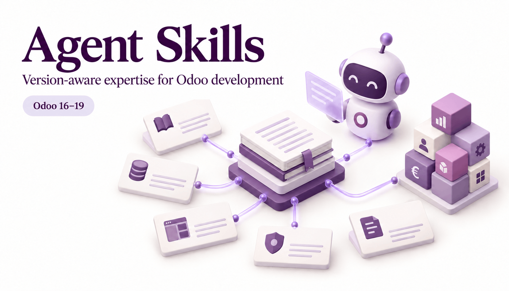
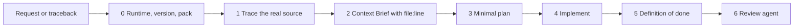
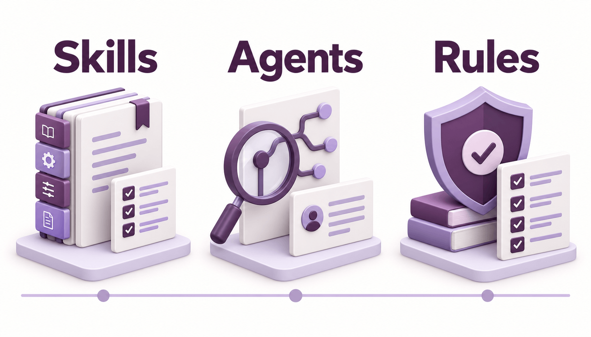

<div align="center">



# Agent Skills

**Version-aware expertise for Odoo development.**

Reference packs, a trace-first development workflow, and specialized reviewers that make AI coding
assistants work from your real Odoo source instead of from memory. Odoo 16–19.

[](https://www.npmjs.com/package/@unclecat/agent-skills-cli)
[](LICENSE)
[](https://github.com/unclecatvn/agent-skills/actions/workflows/ci.yml)

**English** · [Tiếng Việt](README.vi.md)

[Why](#why-it-exists) · [With vs without](#with-and-without-the-skill-one-real-task) · [Quick start](#quick-start) · [First run](#first-run-in-an-odoo-project) · [How it works](#how-the-odoo-workflow-works) · [Prompts](#everyday-prompts) · [Toolkit](#whats-in-the-toolkit) · [Versions](#odoo-versions-and-runtime) · [Contributing](#contributing)

</div>

## Why it exists

AI assistants write plausible Odoo code. The failures that cost time are always the same kind:

- a field, method or xmlid that does not exist in the base addon (`sale.order.delivery_date`,
  `sales_team.group_sale_admin`);
- an xpath anchor that only another module's view adds, so the module fails to install;
- an override hooked on the public method instead of the hook that does the work;
- a stored field renamed without a migration, which silently drops the column and its data;
- a `sudo()` nobody can audit;
- "tests pass" when the test run ran zero tests.

This repository gives the assistant three things against that:

| Part | What it does |
| --- | --- |
| **Odoo reference packs** (16.0, 17.0, 18.0, 19.0) | Version-specific guides for models, fields, views, OWL, security, controllers, reports, tests, migrations, translations and performance, plus an `api-highlights.md` list of what not to use in that version. |
| **Odoo Workflow skill** | A procedure the assistant follows for every Odoo change: find the runtime, trace the real source with a bundled helper, write a Context Brief where every claim has a `file:line`, implement the smallest change, then prove it on a throwaway database. |
| **Agents** | A code tracer and a scored code reviewer that share the same version and runtime rules. |

These are instructions and a read-only helper script, not an Odoo module or an enforcement system.
Results depend on the assistant, the model, and the checks you let it run.

## With and without the skill: one real task

A user in an Odoo 18 project asks the following. As in most real setups, the Odoo source and
`odoo.conf` live outside the project directory, and nothing in the prompt says where:

> In module x_eval, add a stored computed integer field `x_age_days` on `sale.order.line`: days since
> the line's `create_date`.

We ran this task with the same model (Claude Opus 5.5), once with no skill and once with the
`odoo-workflow` skill, and had a separate grader check both answers against the Odoo 18 source
without knowing which was which. Both noticed that a stored compute on `create_date` never
refreshes and added a daily cron. The difference is in what each one knew and what it would have
shipped:

| | Without the skill | With `odoo-workflow` |
| --- | --- | --- |
| Odoo version | Guessed: *"I assumed Odoo 18 (or 19)"* | Found 18.0 in the core's `odoo/release.py`, through the `odoo.conf` in a sibling directory |
| Source read | 3 tool calls, no `file:line` anywhere | 26 tool calls, a Context Brief of 13 cited rows |
| Why `create_date` exists on the line | Not explained | Cited: automatic log field from `odoo/models.py:288` |
| Upgrading a database that already has order lines | Noted that `-u` recomputes every line in Python | Bumps the version to 1.1 and adds `migrations/1.1/pre-migrate.py` that fills the column in SQL, so `-u` does not recompute millions of rows |
| Tests | `-u x_eval --test-tags /x_eval` on an unnamed database, which runs **0 tests and still exits 0** if x_eval is not installed there | Installs on a throwaway `scratch_x_eval` database and requires the log line `0 failed, 0 error(s) of N tests` with N > 0 |
| Grader verdict | 2 of 3 expectations | 3 of 3, preferred |

An excerpt of the Context Brief the skill produced:

| Layer | Symbol | Source (file:line) | Change |
| --- | --- | --- | --- |
| field | `create_date` | `odoo/models.py:288` (automatic field), set once at `models.py:5137` | `@api.depends('create_date')` |
| field | `x_age_days` | NOT FOUND on all three roots (helper exit 1): the name is free | new field |
| method | daily recompute | `addons/membership/models/partner.py:87-91`, `membership/data/membership_data.xml:4-10` | same core pattern |
| migration | new stored compute on a populated table | `odoo/models.py:3474-3487` (new column → recompute every row), `odoo/fields.py:1117` (existing column skips it) | version 1.1 + pre-migration |

### The numbers

The same comparison over the repository's anti-hallucination evals (details and every per-eval row in
[benchmark.md](tests/evals/odoo-workflow/benchmark.md)):

| | Without skill | With `odoo-workflow` |
| --- | --- | --- |
| Realistic setup, 8 evals: expectations passed | 21/23 | **23/23** |
| Realistic setup: evals fully passed | 6/8 | **8/8** |
| Environment given, 24 evals: expectations passed | 70/71 | **71/71** |
| Invented Odoo behaviour (32 runs) | 4 | **2** |
| Code or commands that would ship broken | 0 | 0 |
| Grader prefers (32 pairs) | 6 | **16** (10 ties) |
| Cost: output tokens / tool calls | 1× | ~2× / ~1.7× |

What this says honestly:

- A strong model that can read the source is already careful: neither side shipped broken code on
  these evals. The skill's gain is **grounding and completeness**: cited sources, the migration a
  stored field needs, and tests that provably ran.
- It costs about **twice the tokens**. For a label change that is wasted, which is why the skill has
  a fast path for trivial edits.
- The bundled trace helper answered **34/34** trace questions correctly on real Odoo 18 and 19
  source, where the grep recipe of the previous release answered 12/34 under zsh (every lookup came
  back empty) and 20/34 under bash. See [benchmark.md](tests/evals/odoo-workflow/benchmark.md).

## Quick start

Pick **one** installation route.

### Claude Code plugin (recommended for Claude Code): skills and agents together

```bash
claude plugin marketplace add unclecatvn/agent-skills
claude plugin install agent-skills@unclecat-agent-skills
```

Add `--scope project` to record the installation in the current project instead of your user
settings. Everything appears namespaced by the plugin: skills such as `agent-skills:odoo-workflow`
and `agent-skills:odoo-18-0`, agents such as `agent-skills:odoo-code-tracer`,
`agent-skills:odoo-code-review` and `agent-skills:planner`.

To update later, refresh the marketplace, then install the plugin again:

```bash
claude plugin marketplace update unclecat-agent-skills
claude plugin install agent-skills@unclecat-agent-skills
```

See the [marketplace manifest](.claude-plugin/marketplace.json) and the
[plugin reference](https://code.claude.com/docs/en/plugins-reference).

### Skills installer: any supported assistant

```bash
npx skills add unclecatvn/agent-skills
```

Choose the skills and your assistant in the installer. Install `odoo-workflow` plus the pack for your
Odoo version (`odoo-18`, ...). This route installs skills only, not the standalone agents or rules.
Targets and options are maintained by the [upstream skills CLI](https://github.com/vercel-labs/skills#readme).

### Bundled CLI: copy one pack to a known location

```bash
# List installable packs
npx @unclecat/agent-skills-cli versions skills

# Odoo 18 pack for Cursor
npx @unclecat/agent-skills-cli init --ai cursor --skill skills --version odoo-18.0

# Workflow pack for Claude Code
npx @unclecat/agent-skills-cli init --ai claude --skill skills --version odoo-workflow
```

`--skill skills` names the repository directory and `--version` selects a pack inside it. Pass both:
the CLI's legacy defaults do not match this layout. See [installation notes](#installation-notes).

**Requirements:** Node.js 18+ for the CLI routes; Python 3.8+ for the workflow's helper (standard
library only; the Python in your Odoo virtualenv works); a local checkout of the Odoo source your
project runs (community, plus enterprise if you use it).

## First run in an Odoo project

1. **Open the assistant in your project** (the directory with your custom addons, or its parent).
2. **Let the workflow find the runtime.** On the first Odoo task it runs
   `python3 <skill_dir>/scripts/odoo_trace.py env`, which reads, in order:
   `.claude/odoo.json`, an `odoo-bin` configuration in `.claude/launch.json`, then the one `*.conf`
   whose `addons_path` covers your project (searched in parent directories, so `../18.0/odoo.conf`
   is found). It prints the Odoo version, core path, conf, Python, dev database and the addons roots
   in the order Odoo loads them:

   ```text
   version   18.0  [/path/odoo/18.0/odoo/release.py]
   odoo_root /path/odoo/18.0  [/path/project/.claude/launch.json config "odoo-dev"]
   conf      /path/odoo/18.0/odoo.conf  [same]
   python    /path/odoo/18.0/.venv/bin/python3  [same]
   dev_db    v18_dev  [same]
   addons    conf addons_path
     r1 /path/odoo/18.0/odoo/addons  [odoo/addons (always first)]
     r2 /path/odoo/18.0/addons  [addons_path]
     r3 /path/project/erp  [addons_path]
   VERDICT: Odoo 18.0, 3 roots, 652 modules, base at /path/odoo/18.0/odoo/addons/base
   ```

3. **If it cannot find the runtime**, it asks once and offers to write a gitignored
   `.claude/odoo.json` (paths are machine-local, so do not commit it):

   ```json
   {"odoo_version": "18.0", "odoo_root": "/path/odoo/18.0", "conf": "/path/odoo/18.0/odoo.conf",
    "python": "/path/odoo/18.0/.venv/bin/python3", "dev_db": "v18_dev"}
   ```

4. **Optionally add project rules.** Merge the relevant parts of the
   [project template](skills/odoo-workflow/templates/CLAUDE.md) into your `CLAUDE.md` or `AGENTS.md`
   (do not overwrite it): Odoo version, addons layout, "throwaway databases only", migrations for
   stored-field changes, `_sudo` naming, commit style. The template forbids `Co-Authored-By` and
   `Generated with` lines; to stop Claude Code from adding them, set
   `"attribution": {"commit": "", "pr": ""}` in the project or user `settings.json`.

You can run the helper yourself from a clone of this repository to see what the assistant sees:

```bash
cd /path/to/your/project
python3 /path/to/agent-skills/skills/odoo-workflow/scripts/odoo_trace.py env
python3 /path/to/agent-skills/skills/odoo-workflow/scripts/odoo_trace.py field sale.order access_url
```

## How the Odoo workflow works


```mermaid
flowchart LR
  R[Request or traceback] --> S0[0 Runtime, version, pack]
  S0 --> S1[1 Trace the real source]
  S1 --> S2[2 Context Brief with file:line]
  S2 --> S3[3 Minimal plan]
  S3 --> S4[4 Implement]
  S4 --> S5[5 Definition of done]
  S5 --> S6[6 Review agent]
```

| Step | What happens |
| --- | --- |
| **0. Runtime, version, pack** | The helper resolves core, conf and roots; the version comes from the core's `release.py` (a `.claude/odoo.json` or legacy `.odoo-version` pin must agree, or it stops and asks). The assistant loads the matching pack and its `api-highlights.md`. |
| **1. Trace** | Python symbols through the helper (below); views, OWL templates, JS patches, routes, ACLs and rename impact through zsh- and bash-safe greps over the same roots. |
| **2. Context Brief** | One row per symbol the change touches, each with exactly one of `file:line`, `NOT FOUND`, `UNCERTAIN: <what is missing>` or `AMBIGUOUS: <modules>`. No `file:line`, no code. Rules cover redefined fields, related paths, `depends`, override order, generated xmlids, magic fields, xpath anchors, multi-company, schema changes and `sudo()`. |
| **3. Plan** | At most ten bullets; one commit and PR per git repository touched. |
| **4. Implement** | The narrowest hook, `super()` plus the smallest delta, `_inherit = 'model'`, new files listed in the manifest, `_sudo` naming, translatable strings. |
| **5. Definition of done** | [Commands checked on Odoo 18 and 19](skills/odoo-workflow/references/definition-of-done.md): install and test on `scratch_<module>`, the test summary must count more than 0 tests, upgrade on a database copy when there is a migration, no unloaded files, ACL and company rules, `.pot`/`.po` refresh that keeps file names, the project's linter, hygiene checks per repository, then drop the scratch database. |
| **6. Hand off** | The `odoo-code-review` agent, or its checklist if the agent is not installed. |

Two shortcuts keep it proportionate:

- **Brief only:** "where is X defined?", "does `sale.order` have F?" run Steps 0–2 and answer with
  the Brief.
- **Fast path:** a label, help text or typo in your own module, a manifest bump, or a test-only
  change gets a one-row Brief and skips tracing; the definition of done still applies.

### The trace helper

`skills/odoo-workflow/scripts/odoo_trace.py` parses the source with Python's `ast`, applies the
version's model-naming rules, follows `_inherit` mixins, `_inherits` delegation, `base` extensions and
the core `BaseModel`, skips files the module never imports, and prints absolute `file:line`. It only
reads files.

| Question | Command |
| --- | --- |
| Where does the runtime come from? | `odoo_trace env` / `odoo_trace roots` |
| Which classes define or extend a model, its mixins, `_auto`, `_log_access`? | `odoo_trace model sale.order` |
| Does a field exist (own, mixin, `_inherits`, magic), and where? A dotted path is checked hop by hop. | `odoo_trace field sale.order partner_id.country_id.code` |
| Every definition of a method in `super()` order, with the hooks it calls | `odoo_trace method sale.order _action_confirm --module x_eval` |
| What a module transitively depends on, in load order | `odoo_trace depends x_eval` |
| Does an xmlid exist: loaded XML, CSV row, or generated at install? | `odoo_trace xmlid base.lang_vi_VN` |
| Which files of a module never load? | `odoo_trace unlisted x_eval` |

Exit code 0 means found, 1 NOT FOUND (the verdict lists the closest real names), 2 a setup error. For
example:

```text
$ odoo_trace field sale.order delivery_date
VERDICT: NOT FOUND: sale.order.delivery_date; closest fields: commitment_date (label 'Delivery Date'), ...

$ odoo_trace field sale.order access_url
.../addons/portal/models/portal_mixin.py:13 portal PortalMixin via=parent portal.mixin Char compute='_compute_access_url'
VERDICT: FOUND via parent portal.mixin
```

## Everyday prompts

You do not need to name the skill; it triggers on Odoo work. Being explicit helps on the first run.

- **Add a field or view change:** "In module `sale_extra`, add a boolean `x_rush` to sale orders and
  show it after the warehouse on the form."
- **Fix an install error:** paste the traceback, for example
  `Element '<xpath expr="//field[@name='warehouse_id']">' cannot be located in parent view`. The
  innermost frame in your module is the first citation.
- **Override behaviour:** "After a sale order is confirmed and its pickings exist, post the picking
  names in the chatter." Expect it to trace `action_confirm` → `_action_confirm` and hook the right one.
- **Rename or remove a stored field:** expect a version bump and a `migrations/<version>/` script.
- **Ask about the source:** "Which model gets this field on Odoo 19 when `_inherit` is a list?"
- **Review:** "Review the diff of `sale_extra` for Odoo 18" (uses `odoo-code-review` when installed).

Ask for the evidence: the Brief, the test summary line, and which checks were skipped and why.

## What's in the toolkit



### Skills

| Pack | Purpose |
| --- | --- |
| [Odoo 16.0](skills/odoo-16.0/) | Version-specific development references and API highlights. |
| [Odoo 17.0](skills/odoo-17.0/) | Version-specific development references and API highlights. |
| [Odoo 18.0](skills/odoo-18.0/) | Version-specific development references and API highlights. |
| [Odoo 19.0](skills/odoo-19.0/) | Version-specific development references and API highlights. |
| [Odoo Workflow](skills/odoo-workflow/) | Trace-first procedure for every Odoo change: runtime detection, the trace helper, a cited Context Brief, and a definition of done run on a throwaway database. |
| [Odoo Commit](skills/odoo-commit/) | Odoo-style commit messages, explicit staging, and commit preparation. |
| [Code Review](skills/code-review/) | Requesting reviews, handling feedback, and evidence-based verification. |
| [DTG Base](skills/dtg-base/) | References for DTGBase utilities: dates, timezones, batches, barcodes, text, and files. |
| [Flow Diagram](skills/flow-diagram/) | Interactive HTML/SVG architecture and flow diagrams. |
| [Slide](skills/slide/) | Self-contained HTML/React presentation decks. |

Each Odoo pack starts from its `SKILL.md` index and `references/api-highlights.md`, then one guide
per topic: models, fields, decorators, views, OWL, security, controllers, actions, data, reports,
testing, performance, transactions, migrations, translations, mixins, manifests, development.

### Agents

| Agent | Purpose |
| --- | --- |
| [Odoo Code Tracer](agents/odoo-code-tracer.md) | Follows entry points, overrides, inheritance and side effects through the project source. |
| [Odoo Code Review](agents/odoo-code-review.md) | Reviews Odoo changes for correctness, security, multi-company, performance and version-specific standards, with a scored report. |
| [Planner](agents/planner.md) | Breaks a feature into implementation steps. |

### Rules

- [Coding style](rules/coding-style.md): naming, imports, and code organization.
- [Security](rules/security.md): practices to fold into project instructions and review.

## Odoo versions and runtime

Install the pack that matches your project: **16.0, 17.0, 18.0 or 19.0**. The workflow, its helper
and this release's corrections to the 18.0 and 19.0 packs were checked against the Odoo 18 and 19
source; the rest of the packs, and 16.0/17.0 in particular, are maintained without a full
re-verification against a checkout.

The helper takes the first of:

1. The `--odoo-root`, `--conf` and `--addons` flags.
2. `.claude/odoo.json` in the project or a parent directory, with the keys `odoo_version`,
   `odoo_root`, `conf`, `python`, `dev_db` and, optionally, `addons` (a list that replaces
   `addons_path`).
3. An `odoo-bin` configuration in `.claude/launch.json` whose addons path covers the working
   directory. Relative `addons_path` entries resolve against its `cwd`, as `odoo-bin` does.
4. The one `*.conf` whose uncommented `addons_path` covers the working directory, searched from the
   parent directory upwards (each level and its subdirectories). Two matching confs are a setup
   error: pin one in `.claude/odoo.json`.

The version is `version_info` in the core's `odoo/release.py`. An `odoo_version` in
`.claude/odoo.json` or a `.odoo-version` file must agree with it, or the helper stops instead of
guessing. The workflow and both agents resolve the version in this order:

1. An explicit statement or invocation argument, such as `odoo_version: "18.0"`.
2. The version stated in the project `CLAUDE.md` or `AGENTS.md`.
3. The helper's `env` output.
4. Agents only, when the helper is not available: the same files read by hand, then serie-prefixed
   manifest versions such as `18.0.1.0` or `18.0.1.0.0` (short addon versions like `'1.2'` are
   ignored).
5. Nothing found, or sources that disagree: they ask. There is no default version.

The agents use the pack directory, roots and helper path the workflow passes, or look for an
installed pack; if none is found they say `pack not found` instead of guessing.

## Installation notes

### Bundled CLI targets

Paths are relative to the destination project. `PACK` is the selected directory, such as `odoo-18.0`.

| Target | Files written by the CLI |
| --- | --- |
| `cursor` | `.shared/skills/PACK/` and `.cursor/commands/skills.md` |
| `claude` | `.claude/skills/skills/PACK/` |
| `antigravity` | `.shared/skills/PACK/` and `.agent/workflows/skills.md` |
| `kiro` | `.shared/skills/PACK/` and `.kiro/steering/skills.md` |
| `docs` | `docs/skills/PACK/` |
| `all` | All five destinations above. |

The CLI copies whole pack directories, including the workflow's `scripts/` and `references/`. This
describes file copies, not native skill discovery in every host: for Claude Code use the plugin, for
other assistants the skills installer, or give the copied files to the assistant as context.

- Run from the destination project, or pass `--dest /path/to/project`.
- Existing files are kept unless you pass `--force`.
- Cursor, Antigravity and Kiro share one entry file, `skills.md`; installing another pack keeps the
  existing entry unless forced, and forcing repoints it to the new pack.
- `--offline` skips the CLI's update check; it does not make `npx` itself offline.
- Preview with `--dry-run --offline`:

  ```bash
  npx @unclecat/agent-skills-cli init --ai cursor --skill skills --version odoo-18.0 --dry-run --offline
  ```

### Limits to know

- The workflow can only cite what is on disk: keep the Odoo source (and enterprise, if you use it) in
  a checkout the conf points to.
- The definition of done needs a PostgreSQL server and permission to create `scratch_*` databases.
  The assistant is told never to install or upgrade on a named database unless you ask.
- The trace helper models the static load order of all roots, not what is installed in a given
  database.
- More tokens per task, as measured above. Use the fast path for trivial edits.

## Contributing

Improve version-specific references, add reproducible evals, refine review instructions, or report
gaps through [issues](https://github.com/unclecatvn/agent-skills/issues).

Before opening a pull request:

```bash
npm test
```

This validates skill and agent structure, plugin paths, version consistency, changelog coverage,
selected reference checks, the workflow's Step 1 greps on fixtures under bash and zsh, and the trace
helper on its fixture checkout (`tests/test_odoo_trace.sh`). It does not run Odoo itself. CI also runs
a baseline-aware SkillSpector scan; see the [CI workflow](.github/workflows/ci.yml).

If you change the helper, the greps or the workflow, also run the real-source checks against the
checkouts you have:

```bash
ODOO_ROOT_18=/path/to/odoo/18.0 ODOO_ROOT_19=/path/to/odoo/19.0 bash tests/test_odoo_trace.sh
ODOO_ROOT=/path/to/odoo/18.0 bash tests/odoo-workflow-greps.sh
python3 tests/bench_odoo_workflow.py --odoo 18.0=/path/to/odoo/18.0 --odoo 19.0=/path/to/odoo/19.0
```

- `tests/test_odoo_trace.sh`: hand-verified helper checks on each real checkout; run it under zsh too.
- `tests/odoo-workflow-greps.sh`: the Step 1 greps on real source, once per checkout, under bash and zsh.
- `tests/bench_odoo_workflow.py`: the mechanical benchmark; `--workspace /path/to/project` also checks
  that the resolved roots include the Odoo core.
- `tests/evals/odoo-workflow/`: 24 anti-hallucination evals with fixture modules;
  [benchmark.md](tests/evals/odoo-workflow/benchmark.md) records the last agent runs.

Keep new skills under `skills/` with a `SKILL.md` entry point, keep version-specific changes in their
pack, and include evidence (a source `file:line` or a command you ran) for behavioral claims.

## Releases and license

See the [changelog](CHANGELOG.md) and the [npm package](https://www.npmjs.com/package/@unclecat/agent-skills-cli).
Merging a version bump to `main` tags the release, publishes the GitHub release notes from the
changelog, and publishes the CLI to npm.

Released under the [MIT license](LICENSE). This is an independent community project, not an official
Odoo product.
