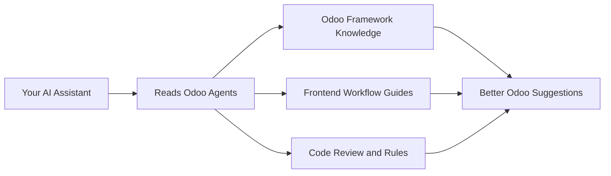

# Odoo Agents


---

## What is Odoo Agents?

**Odoo Agents** is a collection of documentation and specialized agents that help AI coding assistants work more effectively on Odoo and related engineering tasks.

Think of it as a knowledge pack: when you add this repository to your workflow, your AI assistant gains access to curated implementation guidance, review rules, and task-specific frontend workflows that are tailored to real Odoo development.

### Why use it?

- Generic AI assistants give broad programming advice.
- AI assistants with Odoo Agents give Odoo-specific guidance, patterns, and guardrails.

For example, instead of a generic answer about frontend components, you can route the assistant into dedicated skills for Owl component authoring, webclient extension points, or HOOT-based frontend tests.

---

## Use with Codex

Codex is a first-class target for this repository.

### Codex App, CLI, and IDE Extension

1. Clone or open this repository in Codex.
2. Start Codex from the repo root.
3. Codex will read the root `AGENTS.md` for repo guidance and discover repo-scoped skills from `.agents/skills/`.

Useful official docs:

- [Codex docs](https://developers.openai.com/codex)
- [Custom instructions with AGENTS.md](https://developers.openai.com/codex/guides/agents-md)

### Repo Rules for Codex

- Canonical authored skills live in `skills/`.
- `.agents/skills/` is a generated mirror for Codex discovery.
- Edit `skills/` only, then resync the Codex mirror.

---

## Use with Other Skill Consumers

### skills.sh

```bash
npx skills add milzamsz/odoo-agents
```

### Cursor Remote Rule

Use the relevant skill subfolder as the remote rule target, for example:

- repo: `git@github.com:milzamsz/odoo-agents.git`
- branch: `18.0`
- subfolder: `skills/odoo-19.0/` or `skills/odoo-owl/`

### Claude Code and Similar Tools

Use the `skills/` folders directly, or install from the repo through your preferred skill workflow.

---

## What's Inside?

### Skills - Framework Documentation

In-depth guides written specifically for AI consumption:

| Skill | Description |
|-------|-------------|
| **[Odoo 18.0](skills/odoo-18.0/)** | Master Odoo 18 guide covering ORM, XML, reports, testing, and bridge docs for frontend work |
| **[Odoo 19.0](skills/odoo-19.0/)** | Master Odoo 19 guide covering current Odoo APIs and bridge docs for frontend work |
| **[Odoo OWL](skills/odoo-owl/)** | Dedicated Odoo 18/19 Owl component skill for JS/XML/SCSS triplets, assets, templates, and runtime decisions |
| **[Odoo Webclient Extension](skills/odoo-webclient-extension/)** | Registries, client actions, services, hooks, and safe patching patterns for Odoo 18/19 |
| **[Odoo Owl Testing](skills/odoo-owl-testing/)** | HOOT, `web_test_helpers`, `mock_server`, and `web.assets_unit_tests` guidance for Odoo 18/19 |
| **[DTG Base](skills/dtg-base/)** | DTGBase utilities (date/period, timezone, batch, barcode, Vietnamese text) |
| **[Payment Integration](skills/payment-integration/)** | Integration guides for SePay, Polar, Stripe, Paddle, Creem.io |
| **[Code Review](skills/code-review/)** | Standards and protocols for automated code review |
| **[Brainstorming](skills/brainstorming/)** | Structured framework for feature ideation |
| **[Writing Skills](skills/writing-skills/)** | Guide for creating and editing AI skills |
| **[MCP Builder](skills/mcp-builder/)** | Guide for building Model Context Protocol servers |

### Agents - Autonomous Reviewers

Specialized agents that act as senior technical leads:

| Agent | What it does |
|-------|--------------|
| **[Odoo Code Review](agents/odoo-code-review/SKILL.md)** | Automatically reviews Odoo code with scoring (1-10) and detailed feedback |
| **[Odoo Code Tracer](agents/odoo-code-tracer/SKILL.md)** | Traces execution flow from entry point to end, identifying all function calls |
| **[Odoo Module Generator](agents/odoo-module-generator/SKILL.md)** | Scaffolds complete Odoo 18 modules with proper structure |
| **[Odoo Query Optimizer](agents/odoo-query-optimizer/SKILL.md)** | Diagnoses N+1 queries and provides optimization suggestions |
| **[Planner](agents/planner.md)** | Breaks down complex features into actionable implementation steps |

### Rules - Coding Standards

Enforced patterns for consistent, secure code:

| Rule | Description |
|------|-------------|
| **[Coding Style](rules/coding-style.md)** | Best practices for naming, imports, and code structure |
| **[Security](rules/security.md)** | Security patterns for enterprise applications |

---

## Project Structure

```text
odoo-agents/
|-- AGENTS.md                      # Root Codex/project instructions
|-- .agents/
|   `-- skills/                   # Generated Codex mirror of skills/
|-- skills/                       # Canonical authored skill tree
|   |-- odoo-18.0/
|   |-- odoo-19.0/
|   |-- odoo-owl/
|   |-- odoo-webclient-extension/
|   |-- odoo-owl-testing/
|   `-- ...
|-- agents/
|-- rules/
|-- scripts/
|   `-- sync-codex-skills.js
|-- tests/
`-- lib/
```

---

## Validation

Regenerate the Codex mirror after changing any top-level skill:

```bash
node scripts/sync-codex-skills.js --write
```

Verify the mirror is current:

```bash
node scripts/sync-codex-skills.js --check
```

Run the repository smoke test:

```bash
npm test
```

---

## Supported Tools

Odoo Agents works with popular AI-powered tools:

- **Codex App**
- **Codex CLI**
- **Codex IDE Extension**
- **Cursor**
- **Claude Code**
- **Windsurf**
- **Aider**

---

## How It Works


```mermaid
graph LR
    A["Your AI Assistant"] --> B["Reads Odoo Agents"]
    B --> C["Odoo Framework Knowledge"]
    B --> D["Frontend Workflow Guides"]
    B --> E["Code Review and Rules"]
    C --> F["Better Odoo Suggestions"]
    D --> F
    E --> F
```

1. You add Odoo Agents to your workflow.
2. Your AI assistant reads the relevant guidance and skill files.
3. Codex can discover repo-scoped skills from `.agents/skills/`, while other tools can use the canonical `skills/` tree.
4. You get more accurate, version-aware implementation guidance.

---

## Stats

| Metric | Value |
|--------|-------|
| Skill Packs | 11 |
| Dedicated Odoo Frontend Skills | 3 |
| Agents | 3 |
| License | MIT |

---

## Contributing

We welcome contributions:

- Add new skills
- Improve existing docs
- Create agents
- Report issues

When you change a skill:

1. Edit the canonical folder in `skills/`.
2. Run `node scripts/sync-codex-skills.js --write`.
3. Run `npm test`.

---

## Links

- [Repository](https://github.com/milzamsz/odoo-agents)
- [Issues](https://github.com/milzamsz/odoo-agents/issues)
- [Discussions](https://github.com/milzamsz/odoo-agents/discussions)
- [Releases](https://github.com/milzamsz/odoo-agents/releases)
