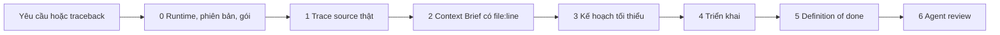

<div align="center">


# Agent Skills

**Kiến thức chuyên sâu theo đúng phiên bản cho phát triển Odoo.**

Bộ tài liệu tham chiếu, quy trình phát triển "trace trước, code sau" và các agent review chuyên biệt,
giúp trợ lý AI viết code dựa trên source Odoo thật của bạn thay vì dựa vào trí nhớ. Hỗ trợ Odoo 16–19.

[](https://www.npmjs.com/package/@unclecat/agent-skills-cli)
[](LICENSE)
[](https://github.com/unclecatvn/agent-skills/actions/workflows/ci.yml)

[English](README.md) · **Tiếng Việt**

[Vì sao](#vì-sao-có-dự-án-này) · [Có và không có skill](#có-và-không-có-skill-một-tác-vụ-thực-tế) · [Bắt đầu nhanh](#bắt-đầu-nhanh) · [Lần chạy đầu](#lần-chạy-đầu-tiên-trong-dự-án-odoo) · [Cách hoạt động](#odoo-workflow-hoạt-động-thế-nào) · [Prompt](#prompt-thường-dùng) · [Bộ công cụ](#bộ-công-cụ-gồm-những-gì) · [Phiên bản](#phiên-bản-odoo-và-runtime) · [Đóng góp](#đóng-góp)

</div>

## Vì sao có dự án này

Trợ lý AI viết code Odoo trông rất hợp lý. Nhưng những lỗi gây mất thời gian thì lúc nào cũng giống nhau:

- field, method hoặc xmlid không hề tồn tại trong addon gốc (`sale.order.delivery_date`,
  `sales_team.group_sale_admin`);
- xpath neo vào một phần tử mà chỉ view của module khác mới thêm vào, nên module cài không được;
- override gắn vào method public thay vì vào hook thực sự làm việc;
- đổi tên stored field mà không có migration, âm thầm xoá cột và toàn bộ dữ liệu của nó;
- một lệnh `sudo()` không ai kiểm soát được;
- báo "test pass" trong khi lần chạy test không chạy test nào.

Repository này trang bị cho trợ lý ba thứ để chống lại những lỗi đó:

| Thành phần | Chức năng |
| --- | --- |
| **Gói tham chiếu Odoo** (16.0, 17.0, 18.0, 19.0) | Hướng dẫn theo từng phiên bản về model, field, view, OWL, security, controller, report, test, migration, bản dịch và hiệu năng, kèm file `api-highlights.md` liệt kê những gì không được dùng ở phiên bản đó. |
| **Skill Odoo Workflow** | Quy trình trợ lý tuân theo cho mọi thay đổi Odoo: tìm runtime, trace source thật bằng script helper đi kèm, viết Context Brief mà mọi khẳng định đều có `file:line`, triển khai thay đổi nhỏ nhất, rồi chứng minh nó chạy được trên một database dùng xong bỏ. |
| **Agent** | Một agent trace code và một agent review code có chấm điểm, dùng chung quy tắc về phiên bản và runtime. |

Đây là bộ hướng dẫn và một script helper chỉ đọc, không phải module Odoo hay hệ thống cưỡng chế.
Kết quả phụ thuộc vào trợ lý, model và những bước kiểm tra bạn cho phép nó chạy.

## Có và không có skill: một tác vụ thực tế

Một người dùng trong dự án Odoo 18 yêu cầu như sau. Giống hầu hết môi trường thực tế, source Odoo và
`odoo.conf` nằm ngoài thư mục dự án, và prompt không hề nói chúng ở đâu:

> In module x_eval, add a stored computed integer field `x_age_days` on `sale.order.line`: days since
> the line's `create_date`.

Chúng tôi chạy tác vụ này với cùng một model (Claude Opus 5.5), một lần không có skill và một lần có
skill `odoo-workflow`, rồi nhờ một grader độc lập đối chiếu cả hai câu trả lời với source Odoo 18 mà
không biết câu nào là của bên nào. Cả hai đều nhận ra stored compute dựa trên `create_date` sẽ không
bao giờ tự cập nhật và đều thêm cron chạy hằng ngày. Khác biệt nằm ở chỗ mỗi bên biết gì và sẽ giao
ra thứ gì:

| | Không có skill | Có `odoo-workflow` |
| --- | --- | --- |
| Phiên bản Odoo | Đoán: *"I assumed Odoo 18 (or 19)"* | Tìm ra 18.0 trong `odoo/release.py` của core, thông qua `odoo.conf` ở thư mục ngang cấp |
| Source đã đọc | 3 lần gọi tool, không có `file:line` nào | 26 lần gọi tool, Context Brief gồm 13 dòng có trích dẫn |
| Vì sao line có `create_date` | Không giải thích | Có trích dẫn: field log tự động từ `odoo/models.py:288` |
| Upgrade database đã có sẵn order line | Ghi chú rằng `-u` sẽ tính lại mọi line bằng Python | Tăng version lên 1.1 và thêm `migrations/1.1/pre-migrate.py` điền cột bằng SQL, để `-u` không phải tính lại hàng triệu dòng |
| Test | `-u x_eval --test-tags /x_eval` trên một database không nêu tên, sẽ chạy **0 test mà vẫn exit 0** nếu x_eval chưa được cài ở đó | Cài trên database dùng xong bỏ `scratch_x_eval` và yêu cầu dòng log `0 failed, 0 error(s) of N tests` với N > 0 |
| Kết luận của grader | Đạt 2/3 tiêu chí | Đạt 3/3, được ưu tiên chọn |

Trích đoạn Context Brief do skill tạo ra:

| Tầng | Symbol | Source (file:line) | Thay đổi |
| --- | --- | --- | --- |
| field | `create_date` | `odoo/models.py:288` (field tự động), được gán một lần tại `models.py:5137` | `@api.depends('create_date')` |
| field | `x_age_days` | NOT FOUND trên cả ba root (helper exit 1): tên này chưa bị dùng | field mới |
| method | tính lại hằng ngày | `addons/membership/models/partner.py:87-91`, `membership/data/membership_data.xml:4-10` | cùng pattern với core |
| migration | stored compute mới trên bảng đã có dữ liệu | `odoo/models.py:3474-3487` (cột mới → tính lại mọi dòng), `odoo/fields.py:1117` (cột đã tồn tại thì bỏ qua) | version 1.1 + pre-migration |

### Các con số

Cùng phép so sánh trên bộ eval chống bịa (anti-hallucination) của repository (chi tiết và từng dòng
kết quả xem tại [benchmark.md](tests/evals/odoo-workflow/benchmark.md)):

| | Không có skill | Có `odoo-workflow` |
| --- | --- | --- |
| Môi trường thực tế, 8 eval: số tiêu chí đạt | 21/23 | **23/23** |
| Môi trường thực tế: số eval đạt trọn vẹn | 6/8 | **8/8** |
| Cho sẵn môi trường, 24 eval: số tiêu chí đạt | 70/71 | **71/71** |
| Bịa ra hành vi Odoo (32 lần chạy) | 4 | **2** |
| Code hoặc lệnh sẽ giao ra bị lỗi | 0 | 0 |
| Grader ưu tiên chọn (32 cặp) | 6 | **16** (10 hoà) |
| Chi phí: output token / số lần gọi tool | 1× | ~2× / ~1.7× |

Nói một cách trung thực:

- Một model mạnh và đọc được source vốn đã cẩn thận: trên các eval này, không bên nào giao code lỗi.
  Giá trị của skill nằm ở **tính có căn cứ và tính đầy đủ**: source có trích dẫn, migration mà stored
  field cần, và test được chứng minh là đã thực sự chạy.
- Nó tốn khoảng **gấp đôi token**. Với việc đổi một label thì đó là lãng phí, nên skill có đường tắt
  (fast path) cho các chỉnh sửa nhỏ.
- Trace helper đi kèm trả lời đúng **34/34** câu hỏi trace trên source Odoo 18 và 19 thật, trong khi
  công thức grep của bản phát hành trước chỉ đúng 12/34 dưới zsh (mọi lần tra đều trả về rỗng) và
  20/34 dưới bash. Xem [benchmark.md](tests/evals/odoo-workflow/benchmark.md).

## Bắt đầu nhanh

Chọn **một** cách cài đặt.

### Plugin Claude Code (khuyên dùng cho Claude Code): cài cả skill và agent

```bash
claude plugin marketplace add unclecatvn/agent-skills
claude plugin install agent-skills@unclecat-agent-skills
```

Thêm `--scope project` để ghi việc cài đặt vào dự án hiện tại thay vì vào cài đặt người dùng. Mọi thứ
đều có namespace của plugin: skill như `agent-skills:odoo-workflow` và `agent-skills:odoo-18-0`, agent
như `agent-skills:odoo-code-tracer`, `agent-skills:odoo-code-review` và `agent-skills:planner`.

Để cập nhật về sau, làm mới marketplace rồi cài lại plugin:

```bash
claude plugin marketplace update unclecat-agent-skills
claude plugin install agent-skills@unclecat-agent-skills
```

Xem [marketplace manifest](.claude-plugin/marketplace.json) và
[tài liệu tham chiếu plugin](https://code.claude.com/docs/en/plugins-reference).

### Trình cài skill: cho mọi trợ lý được hỗ trợ

```bash
npx skills add unclecatvn/agent-skills
```

Chọn skill và trợ lý của bạn trong trình cài. Cài `odoo-workflow` cùng gói ứng với phiên bản Odoo của
bạn (`odoo-18`, ...). Cách này chỉ cài skill, không cài agent độc lập hay rules. Danh sách đích và tuỳ
chọn do [skills CLI gốc](https://github.com/vercel-labs/skills#readme) duy trì.

### CLI đi kèm: chép một gói vào vị trí xác định

```bash
# Liệt kê các gói có thể cài
npx @unclecat/agent-skills-cli versions skills

# Gói Odoo 18 cho Cursor
npx @unclecat/agent-skills-cli init --ai cursor --skill skills --version odoo-18.0

# Gói Workflow cho Claude Code
npx @unclecat/agent-skills-cli init --ai claude --skill skills --version odoo-workflow
```

`--skill skills` là tên thư mục trong repository và `--version` chọn một gói bên trong nó. Hãy truyền
cả hai: giá trị mặc định cũ của CLI không khớp với cấu trúc này. Xem [ghi chú cài đặt](#ghi-chú-cài-đặt).

**Yêu cầu:** Node.js 18+ cho các cách cài bằng CLI; Python 3.8+ cho helper của workflow (chỉ dùng
thư viện chuẩn; Python trong virtualenv Odoo của bạn dùng được); một bản checkout cục bộ của source
Odoo mà dự án đang chạy (community, và enterprise nếu bạn dùng).

## Lần chạy đầu tiên trong dự án Odoo

1. **Mở trợ lý trong dự án của bạn** (thư mục chứa custom addon, hoặc thư mục cha của nó).
2. **Để workflow tự tìm runtime.** Ở tác vụ Odoo đầu tiên, nó chạy
   `python3 <skill_dir>/scripts/odoo_trace.py env`, đọc lần lượt:
   `.claude/odoo.json`, cấu hình `odoo-bin` trong `.claude/launch.json`, rồi đến file `*.conf` duy nhất
   có `addons_path` bao phủ dự án của bạn (tìm ở các thư mục cha, nên `../18.0/odoo.conf` cũng được tìm
   thấy). Nó in ra phiên bản Odoo, đường dẫn core, conf, Python, database dev và các addons root theo
   đúng thứ tự Odoo nạp chúng:

   ```text
   version   18.0  [/path/odoo/18.0/odoo/release.py]
   odoo_root /path/odoo/18.0  [/path/project/.claude/launch.json config "odoo-dev"]
   conf      /path/odoo/18.0/odoo.conf  [same]
   python    /path/odoo/18.0/.venv/bin/python3  [same]
   dev_db    v18_dev  [same]
   addons    conf addons_path
     r1 /path/odoo/18.0/odoo/addons  [odoo/addons (always first)]
     r2 /path/odoo/18.0/addons  [addons_path]
     r3 /path/project/erp  [addons_path]
   VERDICT: Odoo 18.0, 3 roots, 652 modules, base at /path/odoo/18.0/odoo/addons/base
   ```

3. **Nếu không tìm được runtime**, nó hỏi một lần và đề nghị tạo file `.claude/odoo.json` đã được
   gitignore (đường dẫn là của riêng từng máy, nên đừng commit file này):

   ```json
   {"odoo_version": "18.0", "odoo_root": "/path/odoo/18.0", "conf": "/path/odoo/18.0/odoo.conf",
    "python": "/path/odoo/18.0/.venv/bin/python3", "dev_db": "v18_dev"}
   ```

4. **Tuỳ chọn: thêm quy tắc cho dự án.** Gộp các phần phù hợp của
   [template dự án](skills/odoo-workflow/templates/CLAUDE.md) vào `CLAUDE.md` hoặc `AGENTS.md` của bạn
   (đừng ghi đè): phiên bản Odoo, cấu trúc addons, "chỉ dùng database dùng xong bỏ", migration khi đổi
   stored field, quy ước đặt tên `_sudo`, kiểu commit. Template cấm các dòng `Co-Authored-By` và
   `Generated with`; để Claude Code không thêm chúng, đặt `"attribution": {"commit": "", "pr": ""}`
   trong `settings.json` của dự án hoặc người dùng.

Bạn có thể tự chạy helper từ một bản clone của repository này để thấy đúng những gì trợ lý thấy:

```bash
cd /path/to/your/project
python3 /path/to/agent-skills/skills/odoo-workflow/scripts/odoo_trace.py env
python3 /path/to/agent-skills/skills/odoo-workflow/scripts/odoo_trace.py field sale.order access_url
```

## Odoo workflow hoạt động thế nào



| Bước | Điều gì diễn ra |
| --- | --- |
| **0. Runtime, phiên bản, gói** | Helper xác định core, conf và các root; phiên bản lấy từ `release.py` của core (nếu có ghim `.claude/odoo.json` hoặc `.odoo-version` kiểu cũ thì phải khớp, nếu không nó dừng lại và hỏi). Trợ lý nạp gói tương ứng cùng `api-highlights.md` của gói. |
| **1. Trace** | Symbol Python qua helper (xem bên dưới); view, template OWL, patch JS, route, ACL và ảnh hưởng khi đổi tên qua các lệnh grep an toàn cho cả zsh và bash trên cùng các root. |
| **2. Context Brief** | Mỗi symbol mà thay đổi đụng tới là một dòng, mỗi dòng có đúng một trong các giá trị `file:line`, `NOT FOUND`, `UNCERTAIN: <thiếu gì>` hoặc `AMBIGUOUS: <các module>`. Không có `file:line` thì không viết code. Các quy tắc bao quát field bị định nghĩa lại, related path, `depends`, thứ tự override, xmlid được sinh tự động, magic field, điểm neo xpath, đa công ty, thay đổi schema và `sudo()`. |
| **3. Kế hoạch** | Tối đa mười gạch đầu dòng; mỗi git repository bị đụng tới là một commit và một PR. |
| **4. Triển khai** | Hook hẹp nhất, `super()` cộng phần thay đổi nhỏ nhất, `_inherit = 'model'`, file mới được khai báo trong manifest, đặt tên `_sudo`, chuỗi có thể dịch. |
| **5. Definition of done** | [Các lệnh đã được kiểm chứng trên Odoo 18 và 19](skills/odoo-workflow/references/definition-of-done.md): cài và test trên `scratch_<module>`, dòng tổng kết test phải đếm được nhiều hơn 0 test, upgrade trên bản sao database khi có migration, không có file nào không được nạp, ACL và rule công ty, làm mới `.pot`/`.po` mà vẫn giữ tên file, linter của dự án, kiểm tra vệ sinh code cho từng repository, rồi xoá database scratch. |
| **6. Bàn giao** | Agent `odoo-code-review`, hoặc checklist của nó nếu agent chưa được cài. |

Hai lối tắt giúp quy trình tương xứng với độ lớn công việc:

- **Chỉ Brief:** các câu hỏi như "X được định nghĩa ở đâu?", "`sale.order` có field F không?" chỉ chạy
  Bước 0–2 và trả lời bằng Brief.
- **Fast path:** đổi label, help text hay sửa lỗi chính tả trong module của chính bạn, tăng version
  manifest, hoặc thay đổi chỉ liên quan đến test thì chỉ cần Brief một dòng và bỏ qua bước trace;
  definition of done vẫn được áp dụng.

### Trace helper

`skills/odoo-workflow/scripts/odoo_trace.py` phân tích source bằng `ast` của Python, áp dụng quy tắc
đặt tên model theo phiên bản, lần theo mixin trong `_inherit`, uỷ quyền `_inherits`, các phần mở rộng
của `base` và `BaseModel` trong core, bỏ qua các file mà module không bao giờ import, và in ra
`file:line` tuyệt đối. Nó chỉ đọc file.

| Câu hỏi | Lệnh |
| --- | --- |
| Runtime lấy từ đâu? | `odoo_trace env` / `odoo_trace roots` |
| Những class nào định nghĩa hoặc mở rộng một model, mixin của nó, `_auto`, `_log_access`? | `odoo_trace model sale.order` |
| Field có tồn tại không (của chính model, từ mixin, `_inherits`, magic) và ở đâu? Đường dẫn có dấu chấm được kiểm tra từng bước. | `odoo_trace field sale.order partner_id.country_id.code` |
| Mọi định nghĩa của một method theo thứ tự `super()`, kèm các hook nó gọi | `odoo_trace method sale.order _action_confirm --module x_eval` |
| Một module phụ thuộc bắc cầu vào những gì, theo thứ tự nạp | `odoo_trace depends x_eval` |
| Xmlid có tồn tại không: nạp từ XML, dòng CSV, hay được sinh ra khi cài? | `odoo_trace xmlid base.lang_vi_VN` |
| File nào của module không bao giờ được nạp? | `odoo_trace unlisted x_eval` |

Exit code 0 là tìm thấy, 1 là NOT FOUND (kết luận liệt kê các tên thật gần giống nhất), 2 là lỗi cấu
hình. Ví dụ:

```text
$ odoo_trace field sale.order delivery_date
VERDICT: NOT FOUND: sale.order.delivery_date; closest fields: commitment_date (label 'Delivery Date'), ...

$ odoo_trace field sale.order access_url
.../addons/portal/models/portal_mixin.py:13 portal PortalMixin via=parent portal.mixin Char compute='_compute_access_url'
VERDICT: FOUND via parent portal.mixin
```

## Prompt thường dùng

Bạn không cần gọi tên skill; nó tự kích hoạt khi làm việc với Odoo. Nói rõ ràng sẽ có ích ở lần chạy đầu.

- **Thêm field hoặc sửa view:** "Trong module `sale_extra`, thêm field boolean `x_rush` cho sale order
  và hiển thị nó sau warehouse trên form."
- **Sửa lỗi cài đặt:** dán traceback, ví dụ
  `Element '<xpath expr="//field[@name='warehouse_id']">' cannot be located in parent view`. Frame
  trong cùng thuộc module của bạn là trích dẫn đầu tiên.
- **Override hành vi:** "Sau khi sale order được xác nhận và picking đã được tạo, đăng tên các picking
  lên chatter." Kỳ vọng nó trace `action_confirm` → `_action_confirm` và hook vào đúng method.
- **Đổi tên hoặc xoá stored field:** kỳ vọng có tăng version và script `migrations/<version>/`.
- **Hỏi về source:** "Trên Odoo 19, model nào nhận field này khi `_inherit` là một list?"
- **Review:** "Review diff của `sale_extra` cho Odoo 18" (dùng `odoo-code-review` nếu đã cài).

Hãy đòi bằng chứng: Brief, dòng tổng kết test, và những bước kiểm tra nào đã bị bỏ qua, vì sao.

## Bộ công cụ gồm những gì


### Skill

| Gói | Mục đích |
| --- | --- |
| [Odoo 16.0](skills/odoo-16.0/) | Tài liệu tham chiếu phát triển và API highlights theo phiên bản. |
| [Odoo 17.0](skills/odoo-17.0/) | Tài liệu tham chiếu phát triển và API highlights theo phiên bản. |
| [Odoo 18.0](skills/odoo-18.0/) | Tài liệu tham chiếu phát triển và API highlights theo phiên bản. |
| [Odoo 19.0](skills/odoo-19.0/) | Tài liệu tham chiếu phát triển và API highlights theo phiên bản. |
| [Odoo Workflow](skills/odoo-workflow/) | Quy trình trace trước cho mọi thay đổi Odoo: phát hiện runtime, trace helper, Context Brief có trích dẫn, và definition of done chạy trên database dùng xong bỏ. |
| [Odoo Commit](skills/odoo-commit/) | Commit message theo chuẩn Odoo, stage file tường minh và chuẩn bị commit. |
| [Code Review](skills/code-review/) | Yêu cầu review, xử lý phản hồi và kiểm chứng dựa trên bằng chứng. |
| [DTG Base](skills/dtg-base/) | Tham chiếu cho các tiện ích DTGBase: ngày tháng, múi giờ, batch, barcode, văn bản và file. |
| [Flow Diagram](skills/flow-diagram/) | Sơ đồ kiến trúc và luồng dạng HTML/SVG tương tác. |
| [Slide](skills/slide/) | Bộ slide trình chiếu HTML/React độc lập. |

Mỗi gói Odoo bắt đầu từ file chỉ mục `SKILL.md` và `references/api-highlights.md`, sau đó là một
hướng dẫn cho mỗi chủ đề: model, field, decorator, view, OWL, security, controller, action, data,
report, testing, hiệu năng, transaction, migration, bản dịch, mixin, manifest, phát triển module.

### Agent

| Agent | Mục đích |
| --- | --- |
| [Odoo Code Tracer](agents/odoo-code-tracer.md) | Lần theo entry point, override, kế thừa và side effect xuyên suốt source dự án. |
| [Odoo Code Review](agents/odoo-code-review.md) | Review thay đổi Odoo về tính đúng đắn, bảo mật, đa công ty, hiệu năng và chuẩn theo phiên bản, kèm báo cáo chấm điểm. |
| [Planner](agents/planner.md) | Chia nhỏ một tính năng thành các bước triển khai. |

### Rules

- [Coding style](rules/coding-style.md): đặt tên, import và tổ chức code.
- [Security](rules/security.md): các thực hành nên đưa vào hướng dẫn dự án và quy trình review.

## Phiên bản Odoo và runtime

Cài gói khớp với dự án của bạn: **16.0, 17.0, 18.0 hoặc 19.0**. Workflow, helper của nó và các chỉnh
sửa của bản phát hành này cho gói 18.0 và 19.0 đã được đối chiếu với source Odoo 18 và 19; các phần
còn lại của các gói, đặc biệt là 16.0/17.0, được duy trì nhưng chưa được kiểm chứng lại toàn bộ với
một bản checkout.

Helper lấy nguồn đầu tiên tìm được trong danh sách:

1. Các flag `--odoo-root`, `--conf` và `--addons`.
2. `.claude/odoo.json` trong dự án hoặc thư mục cha, với các key `odoo_version`, `odoo_root`, `conf`,
   `python`, `dev_db` và tuỳ chọn `addons` (một list thay thế cho `addons_path`).
3. Cấu hình `odoo-bin` trong `.claude/launch.json` có addons path bao phủ thư mục làm việc. Các mục
   `addons_path` tương đối được tính theo `cwd` của nó, giống cách `odoo-bin` làm.
4. File `*.conf` duy nhất có `addons_path` (không bị comment) bao phủ thư mục làm việc, tìm từ thư mục
   cha trở lên (mỗi cấp và các thư mục con của nó). Có hai conf cùng khớp là lỗi cấu hình: hãy ghim
   một conf trong `.claude/odoo.json`.

Phiên bản là `version_info` trong `odoo/release.py` của core. `odoo_version` trong `.claude/odoo.json`
hoặc file `.odoo-version` phải khớp với nó, nếu không helper sẽ dừng lại thay vì đoán. Workflow và cả
hai agent xác định phiên bản theo thứ tự:

1. Khai báo tường minh hoặc tham số khi gọi, ví dụ `odoo_version: "18.0"`.
2. Phiên bản ghi trong `CLAUDE.md` hoặc `AGENTS.md` của dự án.
3. Kết quả `env` của helper.
4. Chỉ với agent, khi không có helper: tự đọc các file trên, rồi đến version trong manifest có tiền tố
   serie như `18.0.1.0` hoặc `18.0.1.0.0` (version addon dạng ngắn như `'1.2'` bị bỏ qua).
5. Không tìm thấy gì, hoặc các nguồn mâu thuẫn nhau: chúng sẽ hỏi. Không có phiên bản mặc định.

Các agent dùng thư mục gói, các root và đường dẫn helper mà workflow truyền vào, hoặc tự tìm gói đã
cài; nếu không tìm thấy, chúng báo `pack not found` thay vì đoán.

## Ghi chú cài đặt

### Các đích của CLI đi kèm

Đường dẫn tương đối so với dự án đích. `PACK` là thư mục được chọn, ví dụ `odoo-18.0`.

| Đích | File mà CLI ghi ra |
| --- | --- |
| `cursor` | `.shared/skills/PACK/` và `.cursor/commands/skills.md` |
| `claude` | `.claude/skills/skills/PACK/` |
| `antigravity` | `.shared/skills/PACK/` và `.agent/workflows/skills.md` |
| `kiro` | `.shared/skills/PACK/` và `.kiro/steering/skills.md` |
| `docs` | `docs/skills/PACK/` |
| `all` | Cả năm đích ở trên. |

CLI chép nguyên thư mục gói, bao gồm cả `scripts/` và `references/` của workflow. Đây chỉ là chép
file, không đảm bảo mọi host đều tự nhận diện skill: với Claude Code hãy dùng plugin, với các trợ lý
khác dùng trình cài skill, hoặc đưa các file đã chép cho trợ lý làm ngữ cảnh.

- Chạy từ dự án đích, hoặc truyền `--dest /path/to/project`.
- File đã tồn tại được giữ nguyên trừ khi bạn truyền `--force`.
- Cursor, Antigravity và Kiro dùng chung một file entry là `skills.md`; cài thêm gói khác sẽ giữ entry
  hiện có trừ khi dùng force, và khi force thì entry trỏ sang gói mới.
- `--offline` bỏ qua bước kiểm tra cập nhật của CLI; nó không làm cho chính `npx` chạy offline.
- Xem trước với `--dry-run --offline`:

  ```bash
  npx @unclecat/agent-skills-cli init --ai cursor --skill skills --version odoo-18.0 --dry-run --offline
  ```

### Những giới hạn cần biết

- Workflow chỉ trích dẫn được những gì có trên đĩa: hãy giữ source Odoo (và enterprise nếu bạn dùng)
  trong một bản checkout mà conf trỏ tới.
- Definition of done cần một PostgreSQL server và quyền tạo database `scratch_*`. Trợ lý được dặn
  không bao giờ cài hoặc upgrade trên một database có tên trừ khi bạn yêu cầu.
- Trace helper mô phỏng thứ tự nạp tĩnh của mọi root, không phải những gì đã được cài trong một
  database cụ thể.
- Tốn nhiều token hơn cho mỗi tác vụ, như đã đo ở trên. Dùng fast path cho các chỉnh sửa nhỏ.

## Đóng góp

Cải thiện tài liệu tham chiếu theo phiên bản, thêm eval có thể tái lập, tinh chỉnh hướng dẫn review,
hoặc báo cáo chỗ còn thiếu qua [issues](https://github.com/unclecatvn/agent-skills/issues).

Trước khi mở pull request:

```bash
npm test
```

Lệnh này kiểm tra cấu trúc skill và agent, đường dẫn plugin, tính nhất quán của version, độ phủ
changelog, một số kiểm tra tài liệu tham chiếu được chọn, các lệnh grep Bước 1 của workflow trên
fixture dưới bash và zsh, và trace helper trên bản checkout fixture của nó
(`tests/test_odoo_trace.sh`). Nó không chạy Odoo. CI còn chạy thêm một lượt quét SkillSpector có tính
đến baseline; xem [CI workflow](.github/workflows/ci.yml).

Nếu bạn sửa helper, các lệnh grep hoặc workflow, hãy chạy thêm các kiểm tra trên source thật với những
bản checkout bạn có:

```bash
ODOO_ROOT_18=/path/to/odoo/18.0 ODOO_ROOT_19=/path/to/odoo/19.0 bash tests/test_odoo_trace.sh
ODOO_ROOT=/path/to/odoo/18.0 bash tests/odoo-workflow-greps.sh
python3 tests/bench_odoo_workflow.py --odoo 18.0=/path/to/odoo/18.0 --odoo 19.0=/path/to/odoo/19.0
```

- `tests/test_odoo_trace.sh`: các kiểm tra helper đã được xác minh thủ công trên từng bản checkout thật;
  hãy chạy cả dưới zsh.
- `tests/odoo-workflow-greps.sh`: các lệnh grep Bước 1 trên source thật, mỗi bản checkout một lần, dưới
  bash và zsh.
- `tests/bench_odoo_workflow.py`: benchmark cơ học; `--workspace /path/to/project` kiểm tra thêm rằng
  các root đã xác định có bao gồm core Odoo.
- `tests/evals/odoo-workflow/`: 24 eval chống bịa kèm module fixture;
  [benchmark.md](tests/evals/odoo-workflow/benchmark.md) ghi lại các lần chạy agent gần nhất.

Đặt skill mới trong `skills/` với entry point `SKILL.md`, giữ các thay đổi theo phiên bản trong đúng
gói của nó, và kèm bằng chứng (một `file:line` trong source hoặc một lệnh bạn đã chạy) cho mọi khẳng
định về hành vi.

## Phát hành và giấy phép

Xem [changelog](CHANGELOG.md) và [gói npm](https://www.npmjs.com/package/@unclecat/agent-skills-cli).
Merge một lần tăng version vào `main` sẽ tạo tag phát hành, đăng release notes trên GitHub từ
changelog, và publish CLI lên npm.

Phát hành theo [giấy phép MIT](LICENSE). Đây là dự án cộng đồng độc lập, không phải sản phẩm chính
thức của Odoo.
